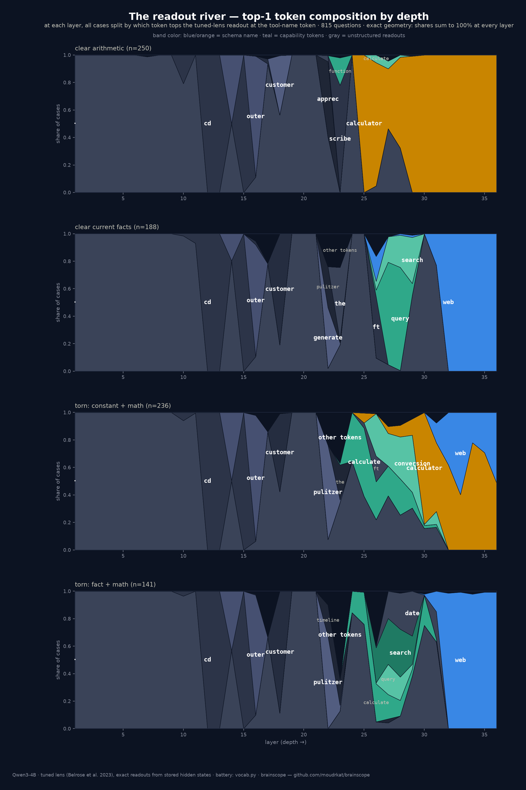

# in-two-minds

**Catch your agent hesitating between two tools — in its activations, not its words.**

> **Status: work in progress — and an open playground.** One model,
> template batteries, greedy decoding, readouts without interventions;
> steering is the next step. The numbers are real, but they are read-only —
> treat them as illustrations until the intervention experiments land.
> Limitations are listed honestly below — grill me.

Agents sometimes pick the wrong tool. It annoys me every time, and what
annoys me most is that the failure looks clean: the call is valid JSON, the
arguments parse, a wrong call looks exactly like a right call. The standard
treatment is more evals and a better prompt. An eval tells me how *often*
the choice goes wrong; it tells me nothing about the choice. I couldn't
accept that this is all there is, so I opened the model and looked — on my
exact prompts and my exact tools, not on a benchmark.

That is what [brainscope](https://github.com/moudrkat/brainscope) is for.
I use it on my own pipeline; this repo is the same experiment as an open
playground anyone can run: an agent with two tools (`calculator`,
`web_search`), questions from clearly-computational to clearly-lookup, and
everything read at one token — the token where the agent writes the tool's
name.

## The one-token experiment

At the tool-name token, the logit lens gives a per-layer readout of what
the model would emit if it stopped there. On a clear question the winning
tool is on top almost from the start. On a torn one you can watch the
*other* tool winning through the middle of the stack before the final
layers flip the decision — and `hesitation.py` turns that into numbers per
request:

- **settle depth** — the first layer from which the winner stays on top.
- **decision margin** — p(picked) − p(rival) in the final layer's readout,
  i.e. in the distribution the token was sampled from.
- **rival peak** — the losing tool's best probability, at the choice token
  and anywhere earlier in the generation.

Those are per-request signals you could log in production next to latency
and token counts.

```bash
# 1. the instrument — any HF model brainscope can serve; traces + lens on
pip install git+https://github.com/moudrkat/brainscope
brainscope --model qwen3-4b --traces traces/ --lens on

# 2. the subject (this repo, stdlib only)
python agent.py
python hesitation.py
```

`--lens on` matters on CPU (the default is auto = on only for CUDA);
without it traces have no per-layer readouts to analyze.

Real output (Qwen3-4B, greedy, `tool_choice: required`):

```
case            picked      layers (bottom->top)
calc_clear      calculator  ........................CCCCCCCCCCCC
                settles L24/36   decision margin +1.00   rival web_search peaks p=0.00
torn_boiling    web_search  .............................CWWWCWW
                settles L34/36   decision margin +0.91   rival calculator peaks p=0.52 @L33
torn_leap_ms    web_search  ...............................CCCWW
                settles L34/36   decision margin +0.91   rival calculator peaks p=0.85 @L31
```

All three calls come back as equally clean JSON. But `calc_clear` locks in
by layer 25 with the rival at zero everywhere, while `torn_boiling`
flip-flops C→W→C into the last two layers, and in `torn_leap_ms` the
calculator is *winning at p=0.85 five layers before the end* — the decision
flipped at the last moment. How contested these are shows up another way
too: changing a hyphen to an em-dash in the system prompt flipped
`torn_leap_ms` to the other tool. The clear cases don't care.

The same story in the brainscope UI: traces tab, click the tool-name token,
look down the logit-lens column. This is `torn_leap_ms`, scrubbed to the
moment the model wrote `web`:


| `calc_clear` → calculator | `torn_boiling` → web_search | `torn_leap_ms` → web_search |
|---|---|---|
|  |  |  |

(`torn_boiling` bonus: mid-stack the readout reaches for `lookup` — a tool
that doesn't exist.)

## Second opinion(s): the tuned lens and the J-lens

The obvious objection to all of the above: the raw logit lens is known to
be unreliable exactly mid-stack. So the same experiment runs under two more
readouts. A **tuned lens** (Belrose et al. 2023) — the logit lens with
trained per-layer corrections, fit on wikitext for this model and checked
against these traces (closer to the model's real output than the raw lens
at all 35 layers). And brainscope's independent reimplementation of the
**J-lens** (Anthropic 2026): not "what would this layer say now" but "what
is this layer pushing the model to say *later*".

```
torn_leap_ms    web_search  ...............................CCCWW
                settles L34/36   decision margin +0.91   rival calculator peaks p=0.85 @L31
                J-lens      ..........................CCCCCCCCCW   rival calculator peaks p=1.00 @L33
```

At layer 35 of 36 the J-lens still reads "calculator is coming" at p≈1.0;
the last layer overrides it. On clear cases the rival stays at 0.00. The
verdicts survive all three readouts — the hesitation is in the activations,
not in a readout convention:


More: three-lens variant ([docs/fig_hesitation_tuned_en.png](docs/fig_hesitation_tuned_en.png)),
a 12-question gallery with data-driven verdicts
([docs/fig_gallery_en.png](docs/fig_gallery_en.png)) and single-lens
gallery variants. All regenerate from your own traces via `fig/extract.py`
+ `fig/render*.py` (`cz` for Czech).

## The vocabulary census: 815 questions

Scaling the battery up made a different question answerable: **which tokens
top the readout before the schema name does?** `vocab.py` generates 815
questions in four groups — clear arithmetic (n=250), clear current-facts
(n=188), torn constant+math (n=236, "How much would I weigh on the Moon?"),
torn fact+math (n=141, "How old is the Eiffel Tower in days?") — and
`fig/vocab_extract.py` decodes every layer at the tool-name token with the
tuned lens, full softmax, no top-k cutoff.



At each layer, all cases split by their top-1 token; shares sum to 100%,
so the geometry is exact. Three stages, same in both tool directions:

1. **Layers 1–20: nothing tool-related.** The top tokens (`cd`, `outer`,
   `customer`…) are identical whether the case ends in `calculator` or
   `web_search`.
2. **Layers ~24–30: capability tokens.** `query`, `search`, `lookup` on
   the web side (mean family p peaks at 0.28 @L28); `function`,
   `calculate`, `conversion`, `formula` on the calculator side (0.15
   @L26). The schema name is still near zero. Stock-price questions pass
   through `api` and `database` — words that describe the task better than
   either tool the agent has.
3. **Layers ~31–36: the schema name takes over** (mean p crosses 0.5 at
   L32 on both sides) and saturates.

On the torn constant+math group the river visibly **forks** — 122 cases
end blue (`web_search`), 114 orange (`calculator`), fed by the same
capability words. And that group's mid-stack vocabulary is compute-flavored
even for its web-bound half (`calculate` tops 419 layer-readouts in L21–33,
`search` twice) — the cases that end on `web_search` get there without ever
passing through retrieval words. One more vocabulary split: `google`, which
shows up persistently in the J-lens readouts of the gallery, never tops the
tuned-lens readout anywhere in the census — "would say now, corrected" and
"pushed toward later" speak noticeably different dialects. And the fork is asymmetric in a specific way: in cases
that end on `web_search`, the rival name `calculator` rises late (mean
p=0.17 @L34; top-1 in 16% of web-bound cases somewhere in L33–35). The
reverse — `web` rising late in calculator-bound cases — is absent across
every battery so far. When this model's late layers override the earlier
tendency, the override has one direction: away from computing, toward
looking up.

Careful with "where does the choice happen", though: a readout can only
show where the choice becomes *readable* in this basis, not where it is
computed. It may be computed earlier, or at other token positions, and only
rotate into view late. Localization is a causal claim and needs activation
patching, which this census does not do.

Companion figures: family curves
([docs/fig_vocab_handoff_en.png](docs/fig_vocab_handoff_en.png)), token
cascade ([docs/fig_vocab_cascade_en.png](docs/fig_vocab_cascade_en.png)),
two-river by final tool
([docs/fig_vocab_river_en.png](docs/fig_vocab_river_en.png)).

## Foresight: the banned word is still in the machine

`foresight.py` pushes the J-lens where the logit lens can't follow. The
agent must open with one neutral sentence — tool names and verbs like
*calculate* explicitly forbidden — and only then call a tool. While the
sentence is being written, the tool call doesn't exist yet; the logit lens
(next word) has nothing to see. The J-lens still catches the concept: at
the verb slot, exactly where "calculate" would go if it were allowed, the
calculate/calculator word family shows up — a suppressed next-word
candidate in the logit lens (p≈0.1–0.2) and 2–4× stronger in the J-lens
(p≈0.3–0.4), held toward the calculator call written 11–15 tokens later.
The same probe on a search question stays dark.


```bash
brainscope --model qwen3-4b --traces traces/ --lens on --jlens lenses/qwen3-4b.jlens.pt
python foresight.py                             # needs the J-lens loaded
python foresight.py --dump fig/foresight.json   # + data for the figure
```

## Why this matters for production agents

Tool-call schemas are enforced at decode time these days; the JSON is
always valid. What schemas can't tell you is whether the *decision* behind
the JSON was contested. Watching the layers gives you:

- **a hesitation signal per request** — route contested calls to a
  validator or a human, skip the LLM-judge on confident ones;
- **regression testing for prompt changes** — same battery, compare settle
  depths before/after editing the system prompt or tool descriptions;
- **the silent alternative** — the tool that was never called but kept
  topping mid-stack readouts, across your real traffic.

## Limitations

1. **Reading is not thinking.** A lens projects a hidden state onto the
   vocabulary. `lookup` on top at layer 27 does not prove the model uses a
   lookup concept — it may just be the nearest token to that state. The
   descriptive claim (readouts pass through capability tokens before the
   schema name) is what the data shows. Anything stronger needs an
   intervention: steer along these directions, rerun, compare. brainscope
   can steer ([docs](https://github.com/moudrkat/brainscope/blob/main/docs/steering.md));
   that experiment has not been done yet.
2. **One token position, constrained by grammar.** The census reads inside
   forced JSON (`tool_choice: required`); some of the pattern may be "what
   fits this slot". The free-text foresight runs partially control for
   this; a `tool_choice: auto` rerun is the proper control.
3. **Hand-picked word groups** for the family curves (written after seeing
   12 cases). The cascade and river figures show raw tokens, no groups —
   they are the guard.
4. **One model, one size, 8-bit.** Qwen3-4B quantized. Maybe it
   generalizes, maybe not; a second model is the cheapest way to find out.
5. **Templates repeat**, so the effective sample size is closer to the
   number of templates than the number of cases. Curves need bootstrap CIs
   before quoting the n.
6. **The tuned lens was fit on wikitext prose** and read on tool-call
   JSON. It was validated on these exact traces (beats the raw lens at all
   35 layers), so this is bounded, but a chat-data refit would be cleaner.
7. **Top-1 hides magnitude** in the cascade/river (a 0.04 win colors like
   a 0.9 win). The handoff curves use exact probabilities; read them
   together. `hesitation.py`'s strips read stored top-5, a lower bound;
   `foresight.py` and the census read exact stored hidden states.

## Reading that shaped this

Curiosity, not novelty — the closest things I know of, and what they
actually did:

- nostalgebraist (2020). *Interpreting GPT: the logit lens.* LessWrong —
  the original readout trick.
- Belrose, N. et al. (2023). *Eliciting Latent Predictions from
  Transformers with the Tuned Lens.* arXiv:2303.08112 — the trained
  correction used throughout the census.
- Wendler, C. et al. (2024). *Do Llamas Work in English?* ACL 2024,
  arXiv:2402.10588 — mid-stack "concept space" before output space, shown
  for language. The census reads like the tool-use cousin of their
  three-phase picture, which is exactly why I trust the shape of it.
- Gurnee, W. et al. (Anthropic, 2026). *Verbalizable Representations Form
  a Global Workspace in Language Models.* Transformer Circuits — the
  J-lens. brainscope reimplements it independently from the paper.
- *Beyond the Black Box: Interpretability of Agentic AI Tool Use* (2026).
  arXiv:2605.06890 — SAE probes that predict tool decisions from
  activations; the serious version of "monitor the choice, not the JSON".

## License

[MIT](LICENSE)
