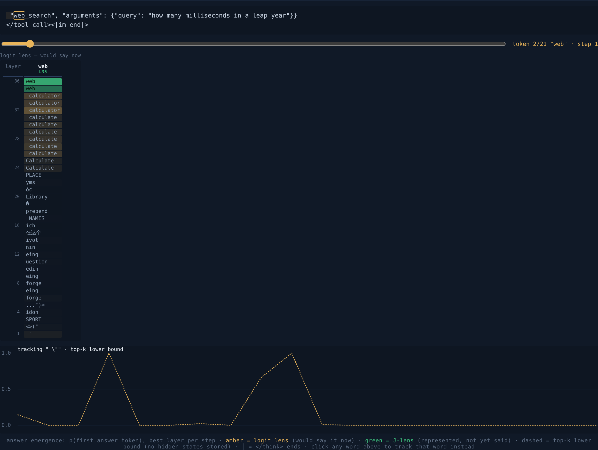
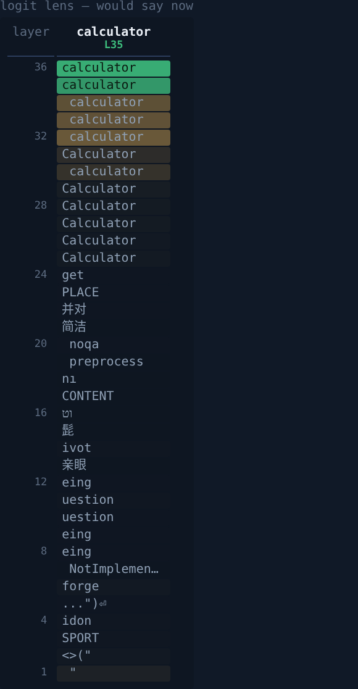
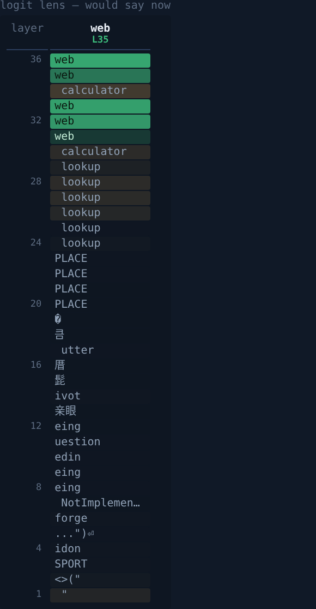
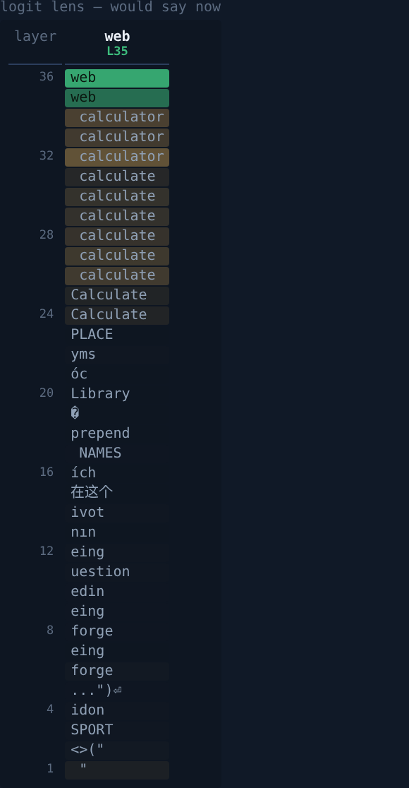
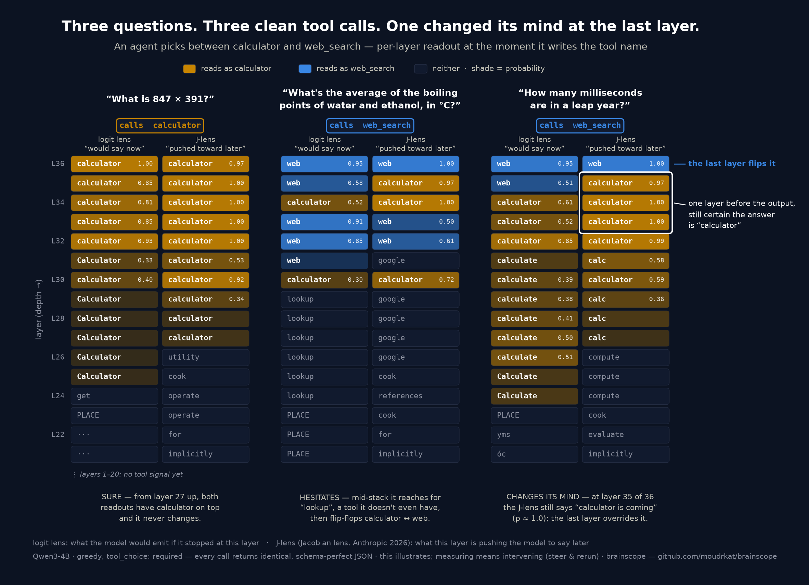
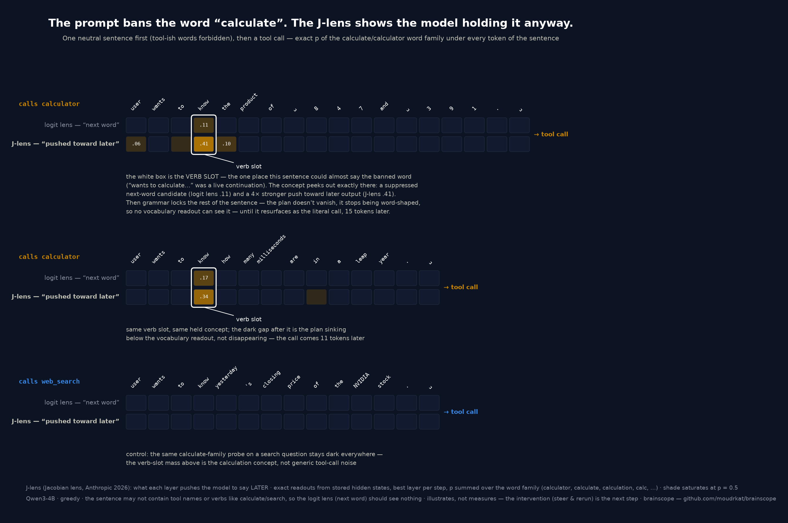

# in-two-minds

**Catch your agent hesitating between two tools — in its activations, not its words.**

> **Status: playing, not measuring.** This is an exploratory demo — raw
> logit lens, one model, a hand-picked battery of five questions, greedy
> decoding. Known gaps before any of it counts as evidence: a tuned lens
> instead of the raw readout, a baseline for how deep ordinary tokens
> settle, resampling to check whether "contested" actually predicts
> flip rate, and many more prompts. Treat every number below as an
> illustration.

A minimal, zero-dependency demo for [brainscope](https://github.com/moudrkat/brainscope):
an agent with two tools (`calculator`, `web_search`) gets five questions —
two clear-cut, three deliberately torn (they need a fact *and* a computation).
The agent answers with a tool call either way; the transcript looks equally
confident every time. The residual stream doesn't.

At the token where the model writes the tool name, the logit lens gives a
per-layer readout of what it would emit if it stopped there. On a clear
question the winning tool is on top almost from the start. On a torn one you
can watch the *other* tool winning through the middle of the stack before the
final layers flip the decision — and `hesitation.py` turns that into two
numbers per request:

- **settle depth** — the first layer from which the winner stays on top.
- **decision margin** — p(picked) − p(rival) in the final layer's readout,
  i.e. in the distribution the token was sampled from.
- **rival peak** — the losing tool's best probability, at the choice token
  and anywhere earlier in the generation.

Those are per-request signals you could log in production next to latency
and token counts. A tool call that settled in the last three layers with
the rival at p=0.5 is a different beast than one that settled ten layers
earlier — even though both return the same clean JSON.

## Run it

```bash
# 1. the instrument — any HF model brainscope can serve; traces + lens on
pip install git+https://github.com/moudrkat/brainscope
brainscope --model qwen3-4b --traces traces/ --lens on

# 2. the subject (this repo, stdlib only)
python agent.py
python hesitation.py
```

`--lens on` matters on CPU (the default is auto = on only for CUDA);
without it traces have no per-layer readouts to analyze.

Real output (Qwen3-4B, greedy, `tool_choice: required`):

```
case            picked      layers (bottom->top)
calc_clear      calculator  ........................CCCCCCCCCCCC
                settles L24/36   decision margin +1.00   rival web_search peaks p=0.00
torn_boiling    web_search  .............................CWWWCWW
                settles L34/36   decision margin +0.91   rival calculator peaks p=0.52 @L33
torn_leap_ms    web_search  ...............................CCCWW
                settles L34/36   decision margin +0.91   rival calculator peaks p=0.85 @L31
```

All three calls come back as equally clean JSON. But `calc_clear` locks in
by layer 25 with the rival at zero everywhere, while `torn_boiling`
flip-flops C→W→C into the last two layers, and in `torn_leap_ms` the
calculator is *winning at p=0.85 five layers before the end* — the
decision flipped at the last moment. How contested these are shows up another way too: changing a
hyphen to an em-dash in the system prompt flipped `torn_leap_ms` to the
other tool. The clear cases don't care.

The same story in the brainscope UI: traces tab, click the tool-name
token, look down the logit-lens column. This is `torn_leap_ms`, scrubbed
to the moment the model wrote `web`:



Layers 24–34 all say *calculator / calculate*; the decision flips in the
last two layers. Side by side, the same column for a clear call and the two
torn ones (bottom = layer 1, top = layer 36 = what gets sampled):

| `calc_clear` → calculator | `torn_boiling` → web_search | `torn_leap_ms` → web_search |
|---|---|---|
|  |  |  |

(`torn_boiling` bonus: mid-stack the model is reaching for `lookup` — a
tool that doesn't exist.)

## Second opinion: the J-lens

Start brainscope with a fitted [J-lens](https://github.com/moudrkat/brainscope/blob/main/docs/jlens.md)
(`--jlens lenses/<model>.jlens.pt`) and `hesitation.py` prints a second
strip per case — the Jacobian-lens readout: not "what would this layer
say now" but "what is this layer pushing the model to say *later*". On
the torn cases it makes the hesitation unmistakable:

```
torn_leap_ms    web_search  ...............................CCCWW
                settles L34/36   decision margin +0.91   rival calculator peaks p=0.85 @L31
                J-lens      ..........................CCCCCCCCCW   rival calculator peaks p=1.00 @L33
```

At layer 35 of 36 the J-lens still reads "calculator is coming" at
p≈1.0; the last layer overrides it and the model writes `web_search`.
On the clear cases the J-lens rival stays at 0.00 — the two lenses
agree from the middle of the stack on. One figure, all of it:



(`fig/extract.py` + `fig/render.py` regenerate this from your own traces;
`render.py cz` for the Czech variant, `render.py logit` for a
logit-lens-only version.)

## Foresight: the banned word is still in the machine

`foresight.py` pushes the J-lens where the logit lens can't follow. The
agent must open with one neutral sentence — tool names and verbs like
*calculate* explicitly forbidden — and only then call a tool. While the
sentence is being written, the tool call doesn't exist yet; the logit
lens (next word) has nothing to see. The J-lens still catches the
concept: at the verb slot, exactly where "calculate" would go if it were
allowed, the calculate/calculator word family shows up — a suppressed
next-word candidate in the logit lens (p≈0.1–0.2) and 2–4× stronger in
the J-lens (p≈0.3–0.4), held toward the calculator call written 11–15
tokens later. The same probe on a search question stays dark, so the
mass is the calculation concept, not generic tool-call noise.



```bash
brainscope --model qwen3-4b --traces traces/ --lens on --jlens lenses/qwen3-4b.jlens.pt
python foresight.py                      # needs the J-lens loaded
python foresight.py --dump fig/foresight.json   # + data for the figure
```

It uses two brainscope features under the hood: per-trace hidden-state
capture (exact readouts instead of stored top-5 lower bounds) and
word-family emergence tracking (`?token=calculator,calculate,calc` sums
the family — mid-sentence a model holds concepts, not exact tokens; the
literal token `calculator` alone reads ~0.00 there).

## Why this matters for production agents

Tool-call schemas are enforced at decode time these days; the JSON is always
valid. What schemas can't tell you is whether the *decision* behind the JSON
was contested. Watching the layers gives you:

- **a hesitation signal per request** — route contested calls to a validator
  or a human, skip the LLM-judge on confident ones;
- **regression testing for prompt changes** — same battery, compare settle
  depths before/after editing the system prompt or tool descriptions;
- **the silent alternative** — the tool that was never called but kept
  lighting up mid-stack, across your real traffic.

## Honesty note

`hesitation.py` reads stored top-5 logit-lens readouts, so its rival/strip
numbers are a lower bound (a tool missing from a layer's top-5 counts as
zero; the final row is exact — it is the sampling distribution).
`foresight.py` stores hidden states and reads exact probabilities. Either
way, a lens is a readout convention, not ground truth about the
computation. This demo **illustrates** contested tool choices on one model
and a hand-picked battery; **measuring** means interventions and
controls — steer the decision, rerun, compare. brainscope can do that part
too (see its [steering docs](https://github.com/moudrkat/brainscope/blob/main/docs/steering.md)).

## License

[MIT](LICENSE)
