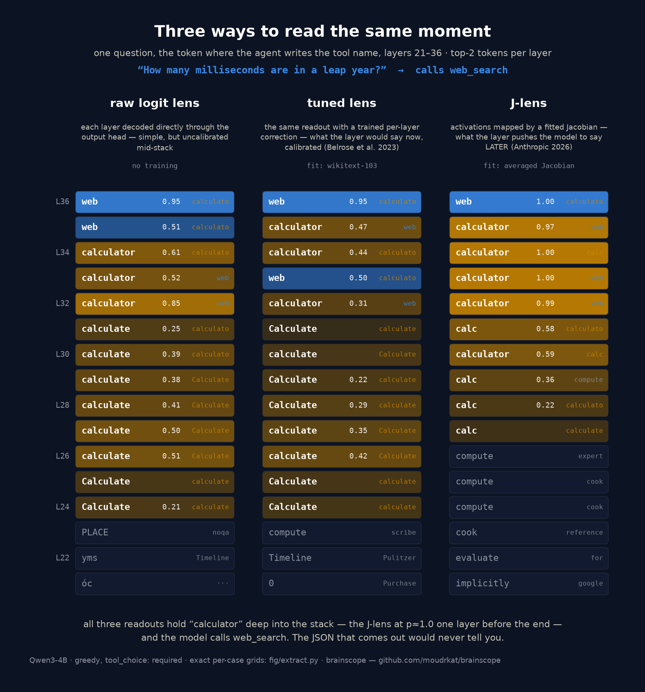
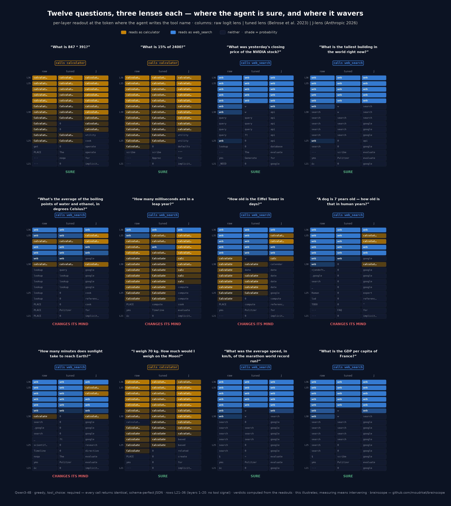
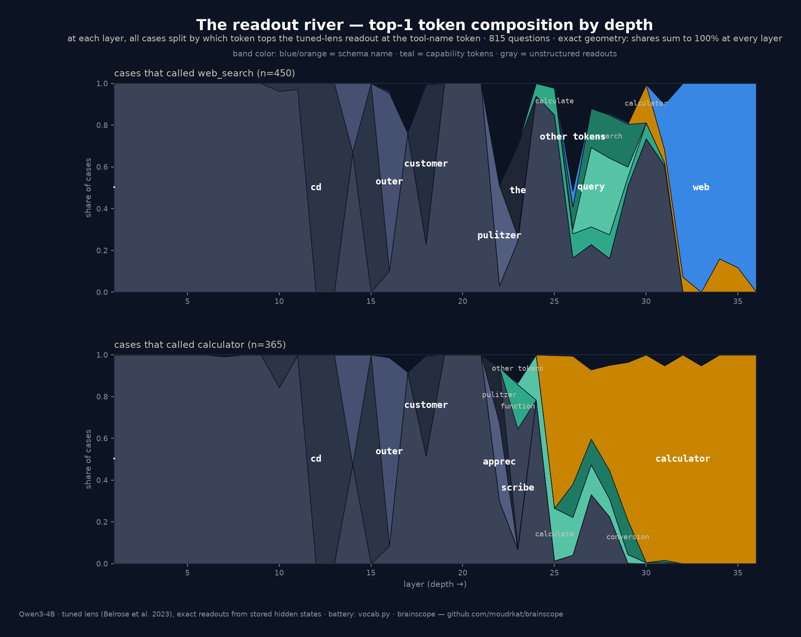
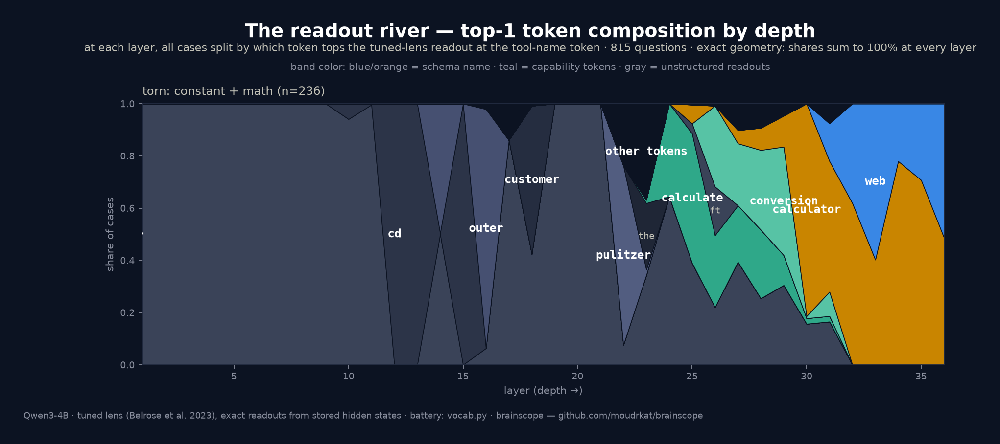
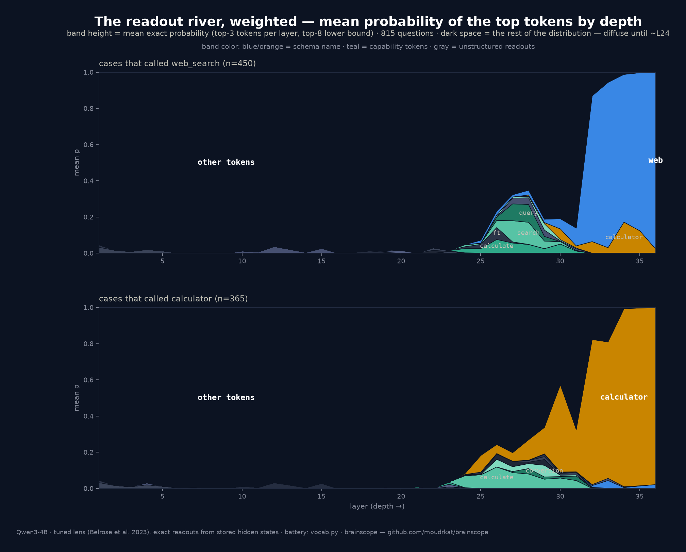
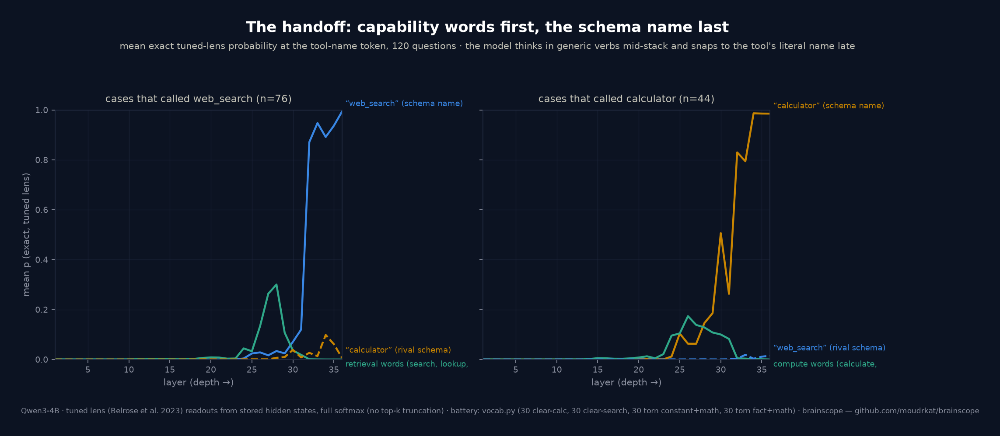
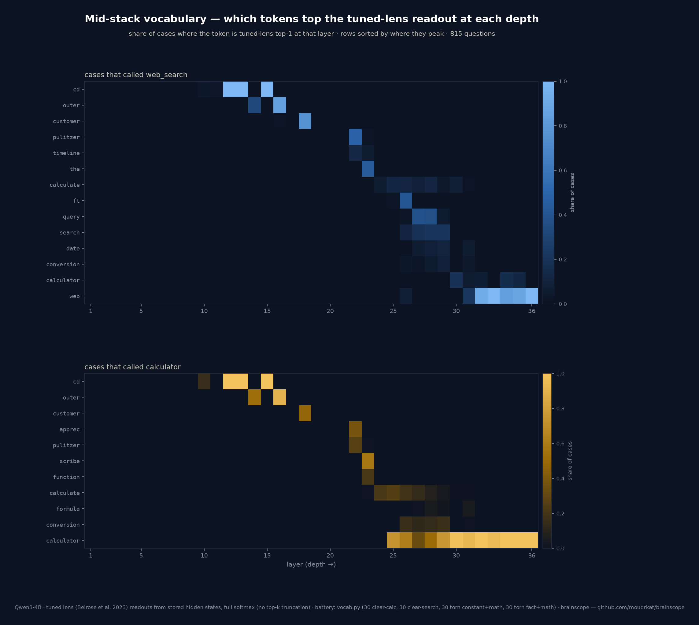
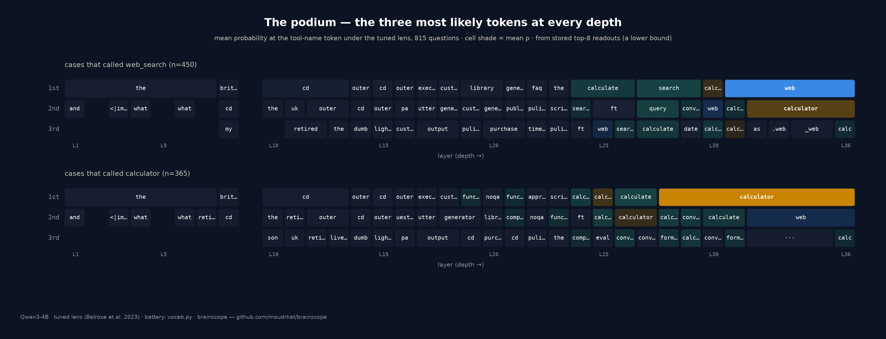
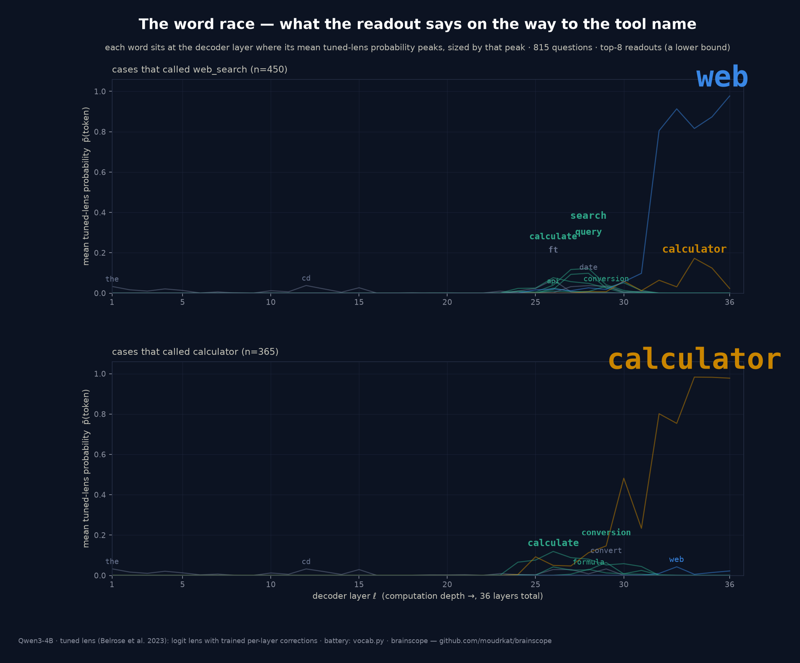
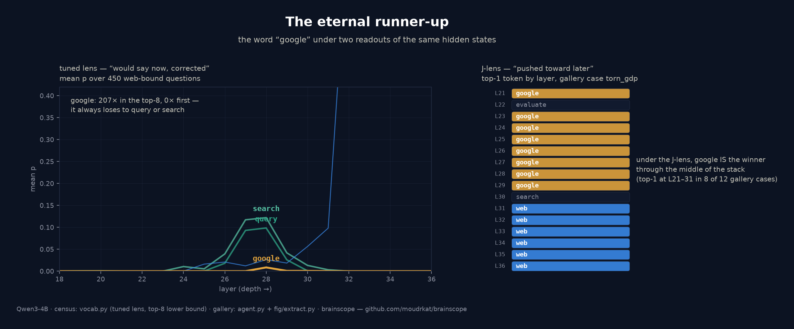

# The figures, explained

A guided tour of every figure in this repo: what it shows, how to read it,
and the one caveat that matters. Every figure has a Czech twin (swap `_en`
for `_cz`) and regenerates with one command from `fig/`. All of them read
the same thing — hidden states stored by
[brainscope](https://github.com/moudrkat/brainscope) while an agent chooses
between `calculator` and `web_search` — at the token where the agent writes
the tool's name.

Reading order: if you're new, start with the lens card, then the
hesitation figure, then the census section.

---

## 1. What the lenses are

### The lens card — three ways to read the same moment

One torn question ("How many milliseconds are in a leap year?"), layers
21–36, three readouts side by side, each with its definition in the header:

- **raw logit lens** — each layer decoded directly through the output
  head. No training. Simple, but uncalibrated mid-stack.
- **tuned lens** (Belrose et al. 2023) — the same readout with a trained
  per-layer correction: *what the layer would say now*, calibrated.
- **J-lens** (Anthropic 2026, independent reimplementation) — activations
  mapped by a fitted averaged Jacobian: *what the layer pushes the model
  to say later*.

Each cell shows the top-2 tokens. All three readouts hold `calculator`
deep into the stack — the J-lens at p≈1.0 one layer before the end — and
the model calls `web_search`. That disagreement between readouts and
output is what the whole repo is about.

Regenerate: `fig/render_lens_card.py [cz]` · data: `fig/figdata_gallery.json`

---

## 2. Single decisions

### The hesitation figure — sure vs hesitating vs changed-its-mind

Three questions, and per-layer readouts at the tool-name token (logit lens
and J-lens columns). A clear question locks in around layer 25 and never
moves. A torn one flip-flops into the last layers. In the third, the
J-lens still reads "calculator is coming" at layer 35 of 36 — the last
layer overrides it. All three calls return identical, schema-perfect JSON.

Variants: `fig_hesitation_logit_*.png` (raw lens only, feed-friendly),
`fig_hesitation_tuned_*.png` (raw | tuned | J-lens — the criticism "the
raw lens is unreliable mid-stack" tested and survived).

Regenerate: `fig/extract.py` + `fig/render.py [cz] [logit|tuned]`

### UI screenshots

`replay-torn-leap-ms.png`, `lens-calc-clear.png`, `lens-torn-boiling.png`,
`lens-torn-leap-ms.png` — the same story as seen live in the brainscope
traces tab: click the tool-name token, read down the logit-lens column.

---

## 3. Twelve questions at once

### The gallery — data-driven verdicts

Twelve questions × three lens columns each, layers 21–36. Verdicts (SURE /
HESITATES / CHANGES ITS MIND) are computed from the readouts, not written
by hand: a rival tool on top at L34–35 in any lens = changed its mind,
rival at L26–33 = hesitates. Single-lens variants
(`fig_gallery_logit|tuned|jlens_*.png`) recompute the verdict from that
lens alone — the J-lens is the boldest of the three, the tuned lens the
most conservative.

One regularity across every battery in this repo: **every late rival is
`calculator`, and every overridden case ends on `web_search` — never the
reverse.**

Regenerate: `fig/render_gallery.py [cz] [logit|tuned|jlens]`

---

## 4. The census (815 questions, tuned lens, exact probabilities)

Battery: `vocab.py` — 250 clear arithmetic, 188 clear current-facts, 236
torn constant+math, 141 torn fact+math. Every layer decoded with the tuned
lens, full softmax over all 151,936 vocabulary entries. Stored per case:
top-8 tokens per layer + exact summed probabilities of concept families.

### The readout river — who wins, layer by layer

At each layer, all cases split by their top-1 token; shares sum to 100%,
so the geometry is exact. Gray = unstructured readouts (early layers,
identical whichever tool wins later). Teal = capability words (`query`,
`search`, `calculate`, `conversion`…). Blue/orange = the schema names,
which absorb the flow in the last ~5 layers.

Per-group variant (`fig_vocab_river_groups_*.png`, and one file per group)
shows the best single panel in the repo: **torn constant+math, where the
river forks** — 122 cases end blue, 114 orange, fed by the same capability
words:

Caveat: cells count *ranks*. A token that wins with p=0.04 colors like one
that wins with p=0.9 — which is why the weighted river exists.

Regenerate: `fig/render_vocab_river.py [groups|clear_calc|clear_search|torn_const|torn_fact] [cz]`

### The weighted river — how much probability those winners actually carry

Same data, band height = mean exact probability of each layer's top-3
tokens. The honest companion to the river above: the early gray "words"
are rank artifacts riding on p≈0.02; the distribution stays diffuse until
about layer 24, and real probability mass only exists in the last dozen
layers.

Regenerate: `fig/render_vocab_river.py top3 [cz]`

### The handoff — family curves

Mean exact probability of concept families by depth, split by the tool the
case finally called. Generic capability words peak mid-stack (0.28 @L28
web-bound, 0.15 @L26 calculator-bound); the schema name crosses 0.5 at L32
on both sides. The dashed curve is the rival schema name — in web-bound
cases `calculator` bumps to mean p=0.17 at L34. These curves use exact
family probabilities (no top-k cutoff), so they are the magnitude-true
view.

Regenerate: `fig/render_vocab.py [cz]`

### The cascade — which literal tokens, at which depth

Share of cases where each literal token is top-1, by layer, rows sorted by
where they peak. The two vocabularies are visibly different dialects:
web-bound runs `query → date → search → web`; calculator-bound runs
`function → calculate → conversion → formula → calculator`.

Regenerate: `fig/render_vocab.py [cz]`

### The podium — first, second, third at every depth

The three tokens with the highest mean probability per layer, as three
lanes. Worth the look for one detail: in the last layers, **the silver
medal belongs to the rival tool in both panels** — `calculator` runs
second behind `web`, `web` runs second behind `calculator`. The
alternative is represented to the end.

Regenerate: `fig/render_podium.py [cz]`

### The word race — the same data as typography

Every token written into the chart at the layer where its mean probability
peaks, sized by that peak, with a thin line tracing its curve. No legend;
the words are the marks. The schema name outgrows everything at the end;
the orange `calculator` standing in the middle of the web panel is the
rival, visible as a word.

Regenerate: `fig/render_wordrace.py [cz]`

### The eternal runner-up — one word, two readouts

`google` under the tuned lens appears 207× in the top-8 across the census
and never once wins — it always loses to `query` or `search`. Under the
J-lens it *is* the winner through the middle of the stack (top-1 at L21–31
in 8 of 12 gallery cases). Same hidden states, two questions — "what would
you say now?" vs "what are you pushing toward?" — two different favorite
words.

Regenerate: `fig/render_eternal_second.py [cz]`

---

## 5. Before the call exists

### Foresight — the banned word is still in the machine

The agent must open with one neutral sentence (tool names and verbs like
*calculate* forbidden) and only then call a tool. While the sentence is
written, the logit lens (next word) has nothing to see; the J-lens reads
the calculate/calculator word family at the verb slot — exactly where the
banned word would go — held toward a call written 11–15 tokens later. The
same probe on a search question stays dark (the control).

Regenerate: `python foresight.py --dump fig/foresight.json` then
`fig/render_foresight.py [cz]`

---

## The caveat that applies to everything

These are readouts, not interventions. They show where a decision becomes
*readable*, not where it is computed, and they cannot by themselves prove
the model "uses" the words they pass through. The full list of limitations
is in the [README](../README.md#limitations); the experiment that would
upgrade all of this — steer along these directions and watch the choice
move — is the next step.
